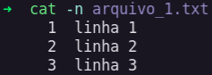

# Concatenar e exibir o conteúdo de arquivos

### Comando `cat`

* **Função**: exibir o conteúdo de arquivos

* **Sintaxe**: `$ cat <nome do arquivo>`

* **Exemplo**: 

  * `$ cat arquivo_1.txt`

    * **Saída**: imprime o conteúdo do arquivo `arquivo_1.txt`

  * `$ cat arquivo_1.txt arquivo_2.txt`

    * **Saída**: imprime o conteúdo, em sequência, do arquivo `arquivo_1.txt` e `arquivo_2.txt`

* **Flags**

  * `-n`

    * **Função**: exibir o conteúdo do arquivo com a numeração de linhas

    * **Sintaxe**: `$ cat -n <nome do arquivo>`

    * **Exemplo**: `$ cat -n arquivo_1.txt`

      * **Saída**

        

### Comando `cat`

* **Função**: concatenar o conteúdo de arquivos

* **Sintaxe**: `$ cat <nome do arquivo> <nome do arquivo> >> <nome do arquivo concatenado>`

* **Exemplo**: `$ cat arquivo_1.txt arquivo_2.txt >> arquivo_concatenado.txt`

  * **Saída**: imprime o conteúdo do arquivo após a junção dos arquivos `arquivo_1.txt` e `arquivo_2.txt`