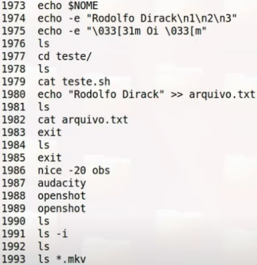
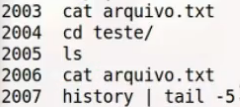

# Exibir o histórico de comandos

### Comando `history`

* **Função**: exibir o histórico de comandos

* **Sintaxe**: `$ history`

* **Exemplo**: `$ history`

  * **Saída**

    

    * Informações exibidas na listagem do histórico de comandos

      Número do comando | Comando
      :---------------: | :-----:

* **OBS**

  * Executar um comando a partir do `número do comando`

    * **Sintaxe**: `$ !<número do comando>`

    * **Exemplo**: `$ !1990`

      * **Saída**: execução do comando `$ ls`

  * Executar o último comando registrado no histórico

    * **Sintaxe**: `$ !!`

    * **Exemplo**: `$ !!`

      * **Saída**: execução do comando `$ ls *.mkv`

  * Executar a última ocorrência de um determinado comando registrada no histórico

    * **Sintaxe**: `$ !<comando>`

    * **Exemplo**: `$ !cat`

      * **Saída**: execução do comando `$ cat arquivo.txt` (comando número `1982`)

  * Recuperar a cauda (*tail*) do histórico, ou seja, as últimas linhas

    * **Sintaxe**: `$ history | tail -<número de linhas>`

    * **Exemplo**: `$ history | tail -5`

      * **Saída**

        
